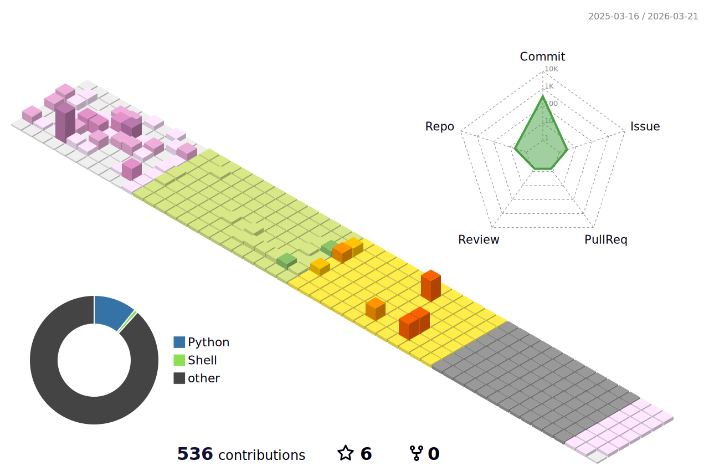

<div align="center">
  </img>
</div>

<!-- <div align="center"> -->
<!-- <a></img></a> -->
<!--     </img> -->
<!-- </div> -->

<div align="center">
  <a></a>
  <a></a>
  <a></a>
<!--   <a></a> -->
</div>
<!-- 
Fleur De Leah
Shrikhand
Rubik Mono One
Source Code Pro
Yellowtail
Bungee
Press Start 2P
Parisienne
Courgette
Permanent Marker
Lobster
Smooch
 -->
<!-- Libre Barcode 39 Extended Text -->


<!-- <div align="center">🌱 <strong>I’m confused about what to do and to learn for my future.</strong></div> -->
<div align="center">🌱 <strong>I’m feeling stressed for my future life.</strong></div>

<!--  -->

## 🧐 About

- 📫 How to reach me: breeze.shane@protonmail.com
- :earth_asia: Where is my blog: [https://blog.bzane.com/](https://blog.bzane.com/)
- 🌱 Using Languages: []() []() []() []()
- 🧰 Using Frameworks: []() []() []() 
- ⚙️ Using Engines: []() <!-- []() -->
- 🗃️ Using Databases: []() []() []()
- 🤔 Know a bit: []() []() []() []() []()
<!-- - ⚒️ Using IDEs: [](https://www.jetbrains.com/clion/) [](https://www.jetbrains.com/pycharm/) [](https://www.jetbrains.com/idea/) [](https://code.visualstudio.com/) -->
<!-- []()-->

<div align="center">
  <br >
  
  </img>
  
</div>

<!-- ## 🛠 Programming Tools: -->
<!-- <div align="center"> -->
<!--  <code></a></code> -->
<!--  <code></code> -->
<!--   <code></code> -->
<!--   <code></code> -->
<!--  <code></code> -->
<!--  <code></code> -->
<!-- </div> -->

## Here is my trophy:

<div align="center">
  </img>
</div>

## How much time I spent on:

<!--START_SECTION:waka-->

```python
From: 15 December 2021 - To: 23 September 2025

Total Time: 1,067 hrs 21 mins

Python                     356 hrs 56 mins ████████░░░░░░░░░░░░░░░░░   32.63 %
Markdown                   284 hrs 27 mins ██████▓░░░░░░░░░░░░░░░░░░   26.01 %
Rust                       105 hrs 30 mins ██▒░░░░░░░░░░░░░░░░░░░░░░   09.65 %
TypeScript                 68 hrs 3 mins   █▓░░░░░░░░░░░░░░░░░░░░░░░   06.22 %
Vue.js                     66 hrs          █▓░░░░░░░░░░░░░░░░░░░░░░░   06.03 %
HTML                       37 hrs 39 mins  █░░░░░░░░░░░░░░░░░░░░░░░░   03.44 %
JavaScript                 28 hrs 14 mins  ▓░░░░░░░░░░░░░░░░░░░░░░░░   02.58 %
Other                      26 hrs 27 mins  ▓░░░░░░░░░░░░░░░░░░░░░░░░   02.42 %
```

<!--END_SECTION:waka-->



<div align="center">
  </img>
</div>

<!-- <div align="center">
  
</div> -->


<!--
dark, radical, merko, gruvbox, tokyonight, onedark, cobalt, synthwave, highcontrast, dracula
**BreezeShane/BreezeShane** is a ✨ _special_ ✨ repository because its `README.md` (this file) appears on your GitHub profile.

Here are some ideas to get you started:

- 🔭 I’m currently working on ...
- 🌱 I’m currently learning ...
- 👯 I’m looking to collaborate on ...
- 🤔 I’m looking for help with ...
- 💬 Ask me about ...
- 📫 How to reach me: ...
- 😄 Pronouns: ...
- ⚡ Fun fact: ...
- [](https://reactjs.org/)
<code></code>
https://github.com/ryo-ma/github-profile-trophy
-->

